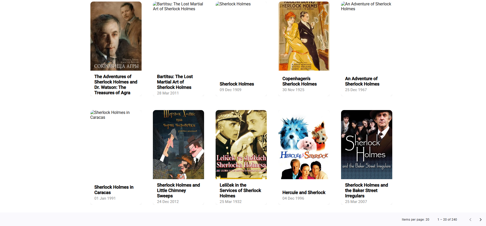

# MovieApp




Bu proje, Angular ve Angular Material kullanılarak geliştirilmiş modern bir film listeleme uygulamasıdır. TMDB API'den popüler filmleri çekip, grid/card yapısında şık bir şekilde göstermektedir.

## Özellikler ve Yapılanlar

### 1. **State Management (Durum Yönetimi)**
- Uygulamada film listesi, türler, yüklenme durumu ve hata mesajları için **RxJS BehaviorSubject** ve **Observable** tabanlı bir state management yapısı kullanıldı.
- `MovieService` içinde filmler, türler, loading ve error state'leri BehaviorSubject ile tutuluyor ve component'ler bu state'leri subscribe ederek reaktif şekilde güncelleniyor.
- Bu yapı sayesinde uygulama daha ölçeklenebilir, test edilebilir ve reaktif hale getirildi.
- State management ile arama, sayfalama ve tür eşleştirme işlemleri merkezi olarak yönetiliyor.

### 2. **Angular Material Grid/Card Tasarımı**
- Her satırda 5 film kartı olacak şekilde responsive ve modern bir grid yapısı oluşturuldu.
- Kartlar eşit boyutlu ve ortalanmış şekilde dizildi.
- Her kartta film afişi, adı, çıkış tarihi ve tür bilgisi gösteriliyor.
- Kartlar tıklanabilir ve Material Design standartlarına uygun şekilde stillendi.

### 3. **TMDB API Entegrasyonu**
- Popüler filmler ve arama sonuçları TMDB API'den dinamik olarak çekiliyor.
- Film türleri ayrıca TMDB'den çekilip, film kartlarında gösteriliyor.
- API çağrıları parametreli (arama ve sayfa numarası) şekilde yapılıyor.

### 4. **Arama Çubuğu ve Tasarım**
- Gridin üstünde Angular Material ile modern bir arama çubuğu eklendi.
- Arama çubuğu özel bir gradient arka plan, border ve köşe yuvarlaklığı ile tasarlandı.
- Kullanıcı arama yaptıkça sonuçlar anında güncelleniyor.

### 5. **Film Detay Modalı (Dialog)**
- Film kartına tıklandığında Angular Material Dialog ile film detayları modal olarak gösteriliyor.
- Modalda film adı, afiş (orantılı ve kırpılmadan), puan, açıklama, türler ve çıkış tarihi gösteriliyor.
- Modalın görsel oranı ve genişliği özel SCSS ile optimize edildi.

### 6. **Sayfalama (Pagination) Özelliği**
- Angular Material `mat-paginator` ile sayfalama desteği eklendi.
- Kullanıcı sayfa değiştirdikçe yeni filmler yükleniyor.
- API'den gelen toplam sayfa bilgisi ile paginator dinamik çalışıyor.
- Aşağıda sayfalama özelliğinin ekran görüntüsü:


### 7. **Responsive ve Modern Tasarım**
- Tüm grid ve kart yapısı responsive olarak tasarlandı.
- Kartlar, grid ve arama çubuğu Material Design standartlarına uygun şekilde SCSS ile özelleştirildi.
- Modal (film detay) için özel SCSS dosyası oluşturuldu ve inline style'lar kaldırıldı.

### 8. **Ekstra: Proje Görselleri**
- Proje ana başlığı altında `src/assets/image1.png`, `src/assets/image2.png` ve `src/assets/image3.png` görselleri kullanıldı.

---

## Mimari ve Kullanılan Teknolojiler
- **Angular 15+** ve **Angular Material** ile modern component tabanlı mimari.
- **RxJS** ile reaktif programlama ve state management.
- **TMDB API** ile gerçek zamanlı film ve tür verisi.
- **SCSS** ile özelleştirilmiş, modüler ve responsive stiller.
- **Material Design** prensiplerine uygun UI/UX.

---

## Kurulum ve Çalıştırma

1. Bağımlılıkları yükleyin:
   ```bash
   npm install
   ```
2. Uygulamayı başlatın:
   ```bash
   ng serve
   ```
3. Tarayıcıda `http://localhost:4200` adresine gidin.

---

## Notlar
- TMDB API anahtarı ve endpointleri `src/environments/environment.ts` dosyasında tanımlıdır.
- Daha fazla özellik veya geliştirme için katkıda bulunabilirsiniz.

---

**Görseller:**


