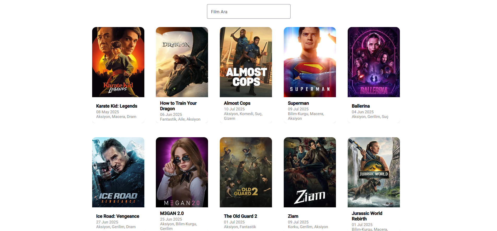
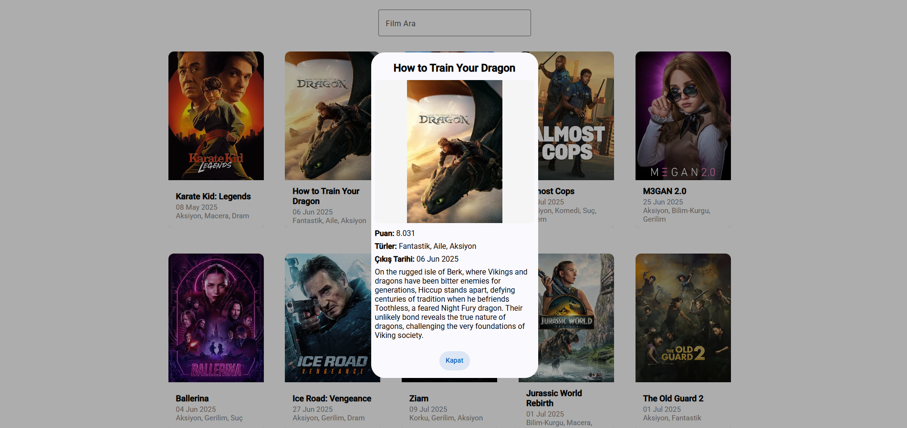

# MovieApp




Bu proje, Angular ve Angular Material kullanılarak geliştirilmiş modern bir film listeleme uygulamasıdır. TMDB API'den popüler filmleri çekip, grid/card yapısında şık bir şekilde göstermektedir.

## Özellikler ve Yapılanlar

### 1. **Angular Material Grid/Card Tasarımı**
- Her satırda 5 film kartı olacak şekilde responsive ve modern bir grid yapısı oluşturuldu.
- Kartlar eşit boyutlu ve ortalanmış şekilde dizildi.
- Her kartta film afişi, adı, çıkış tarihi ve tür bilgisi gösteriliyor.
- Kartlar tıklanabilir ve Material Design standartlarına uygun şekilde stillendi.

### 2. **TMDB API Entegrasyonu**
- Popüler filmler TMDB API'den dinamik olarak çekiliyor.
- Film türleri ayrıca TMDB'den çekilip, film kartlarında gösteriliyor.

### 3. **Arama Çubuğu**
- Gridin üstünde Angular Material ile modern bir arama çubuğu eklendi (şu an sadece görsel, işlevsellik eklenebilir).

### 4. **Film Detay Modalı (Dialog)**
- Film kartına tıklandığında Angular Material Dialog ile film detayları modal olarak gösteriliyor.
- Modalda film adı, afiş (orantılı ve kırpılmadan), puan, açıklama, türler ve çıkış tarihi gösteriliyor.
- Modalın görsel oranı ve genişliği özel SCSS ile optimize edildi.

### 5. **Responsive ve Modern Tasarım**
- Tüm grid ve kart yapısı responsive olarak tasarlandı.
- Kartlar, grid ve arama çubuğu Material Design standartlarına uygun şekilde SCSS ile özelleştirildi.
- Modal (film detay) için özel SCSS dosyası oluşturuldu ve inline style'lar kaldırıldı.

### 6. **Ekstra: Proje Görselleri**
- Proje ana başlığı altında `src/assets/image1.png` ve `src/assets/image2.png` görselleri kullanıldı.

---

## Kurulum ve Çalıştırma

1. Bağımlılıkları yükleyin:
   ```bash
   npm install
   ```
2. Uygulamayı başlatın:
   ```bash
   ng serve
   ```
3. Tarayıcıda `http://localhost:4200` adresine gidin.

---

## Notlar
- TMDB API anahtarı ve endpointleri `src/environments/environment.ts` dosyasında tanımlıdır.
- Daha fazla özellik veya geliştirme için katkıda bulunabilirsiniz.

---

**Görseller:**


